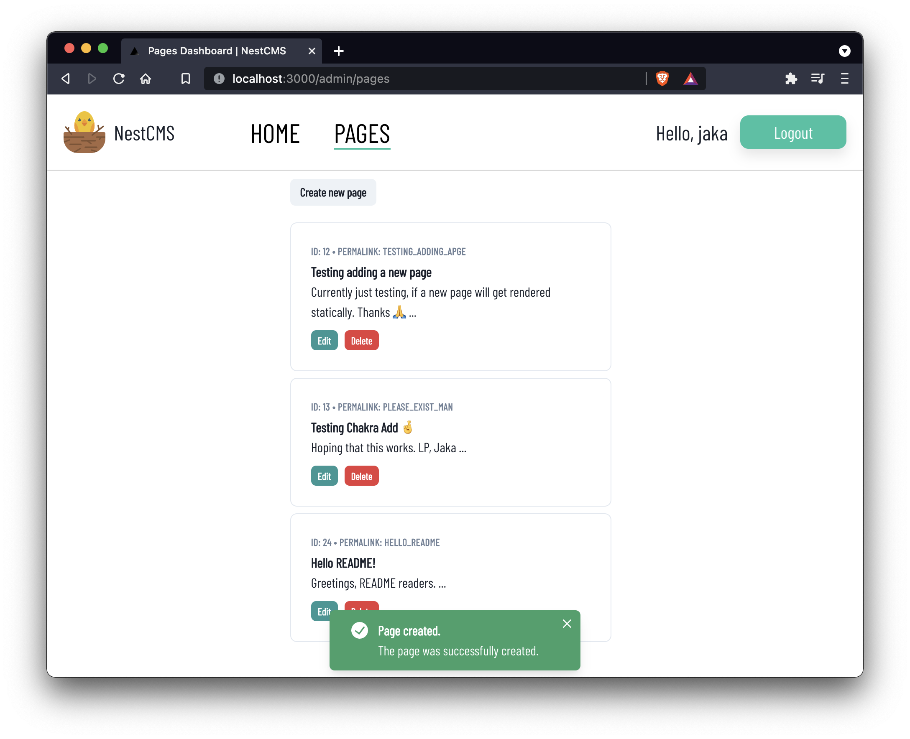

# NestCMS client

## NestCMS

This is the repository containing all of the frontend code necessary to run NestCMS. NestCMS is a simple content management system build with NestJS on the backend and React (Next.js) on the frontend.



This repository houses the frontend code which connects to the backend code of the [NestCMS server](https://github.com/jstavanja/NestCMSServer).

## Installation

Node version 14+ is required to run this project.

To install the dependencies, run the following command:

```bash
npm install
# or
yarn
```

## Getting Started

First, run the development server:

```bash
npm run dev
# or
yarn dev
```

Open [http://localhost:3000](http://localhost:3000) with your browser to see the result. Make sure, your backend code is also running on the correct port.

## Interesting notes

The pages on the frontend are statically generated during the app build time, which means that full server-side rendering support is available.


## Stay in touch

- Author - [Jaka Stavanja](https://stavanja.xyz)
